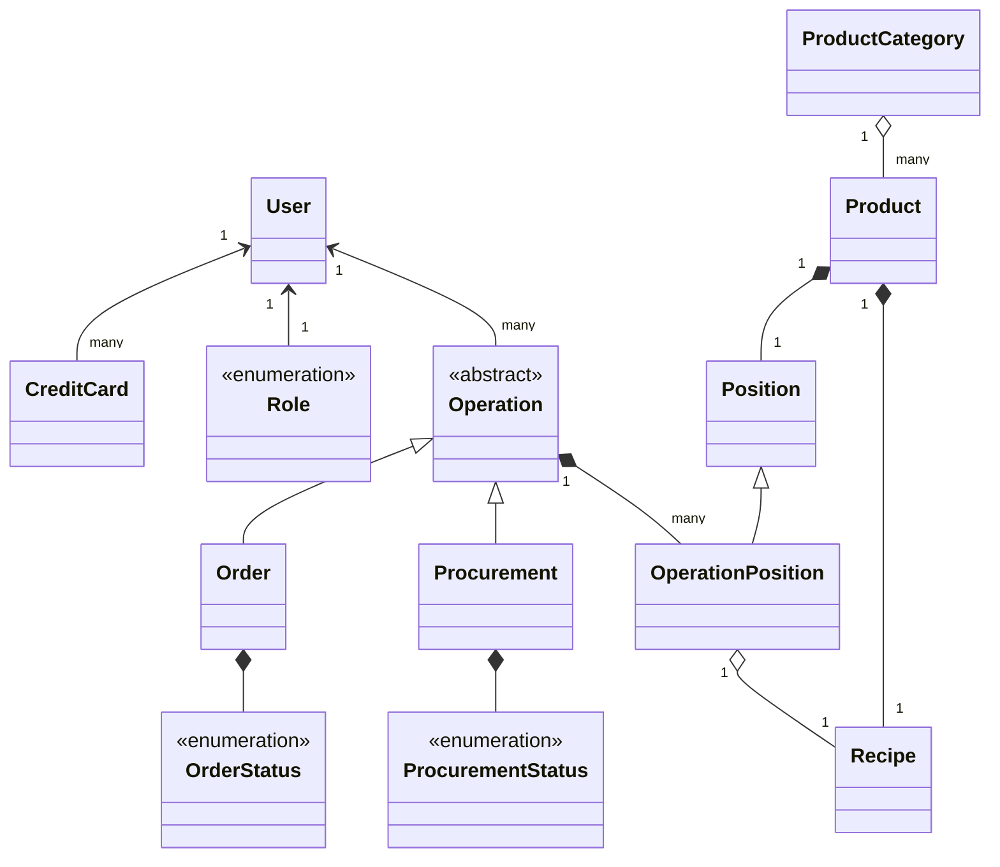

## Online Pharmacy
This project represents the online pharmacy.  

Main entities are User, Operation, Product. User can have many credit cards and one role. User can perform operations such as procurement and order.  

Every operation contains list of operation positions. Operation position contains information about product and its quantity.
Procurement adds positions to stock. Order takes positions from stock.  

